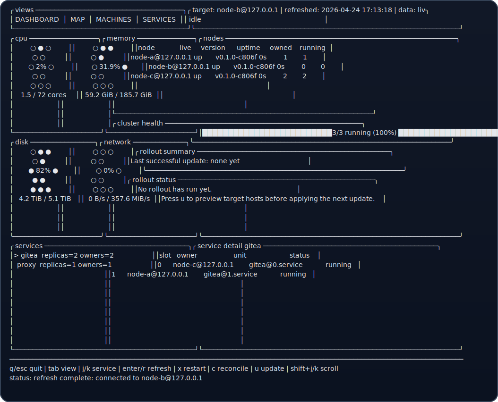
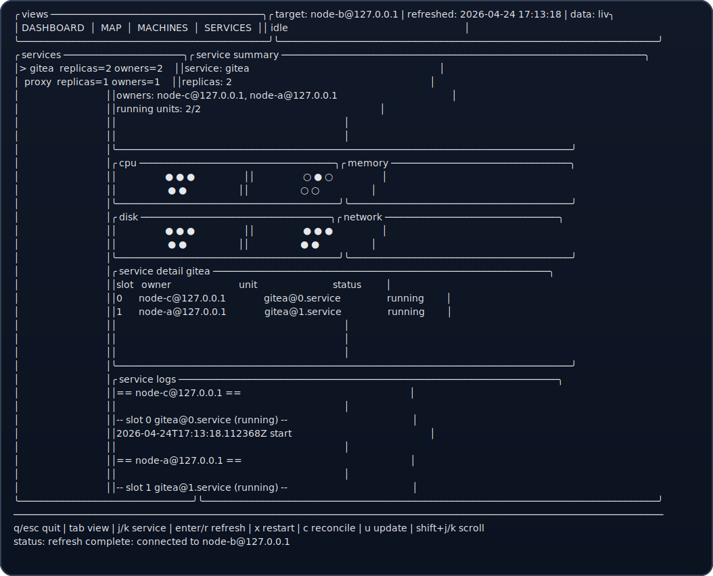

# Nix-Swarm

Nix-Swarm is a **TUI-first, leaderless NixOS orchestrator** for small clusters. Every node runs the same OTP runtime, computes the same placement from shared Nix config, and only starts or stops its own local systemd units.

Nix-Swarm is for **Nix + systemd + distributed Erlang**. It is **not** a container platform and **not** a storage orchestrator.

> **v0.1.4 alpha:** Nix-Swarm is ready for public testing on trusted homelab/LAN clusters, but the config format, TUI workflows, and remote API may still change. Do not expose the Erlang distribution ports to untrusted networks.





## Features

- **Operator TUI** for dashboard, topology map, machines, services, logs, rollout, dry-run, and apply workflows
- **Declarative Nix config** split into cluster, machine, and service files
- **Leaderless failover** with no central scheduler
- **Systemd-native runtime** instead of containers
- **Cluster + per-machine/service metrics**
- **Built-in config editing** from the TUI, with your system editor and return-to-TUI flow

## v1 design boundaries

- Nix remains the durable source of truth; TUI start/stop controls are temporary in-memory overrides.
- Placement is deterministic from shared config plus live configured peers. There is no leader, consensus scheduler, metric-based rebalancer, or durable control-plane state.
- v1 targets small trusted clusters, roughly 2-10 NixOS nodes, and assumes stateless or externally-backed services.
- `constraints` are hard all-of label filters, `allowedNodes` is an optional hard node allowlist, and `preferredNodes` is only a soft ordering bias.
- `replicas = 0` declaratively disables a service. Multi-replica services must use slot-addressable systemd template units and slot-distinct ports.
- Healthchecks and metrics are visibility metadata in v1; they do not drive restarts, failover, placement, or rebalancing.
- Built-in apply/update uses a local working tree, SSH sync, and sequential `nixos-rebuild switch`; failures are reported for manual recovery rather than automatic rollback.

## Security model

Nix-Swarm uses distributed Erlang for node-to-node RPC. Authentication is based on a shared Erlang cookie; traffic is not TLS-encrypted by Nix-Swarm itself.

- Run Nix-Swarm only on trusted networks or through your own VPN/private overlay.
- Restrict TCP `4369` (EPMD) and the Nix-Swarm distribution port (`4370` by default) with firewall rules.
- Generate a strong cookie once, store it outside the Nix store, and distribute it securely to every managed node and operator workstation.
- Keep cookie files readable only by the owning root/nix-swarm context:

```bash
install -m 600 -o root -g root /path/to/generated.cookie /etc/nixos/nix-swarm/secrets/nix-swarm.cookie
```

The packaged operator first checks `~/.config/nix-swarm/secrets/{nix-swarm.cookie,swarm.cookie}` for a local operator cookie, then falls back to `/etc/nixos/nix-swarm/secrets/nix-swarm.cookie` when it is readable. You can still override that with `NIX_SWARM_COOKIE_FILE` or `NIX_SWARM_COOKIE`.

On first launch, the packaged operator also seeds a full editable working tree under `~/.config/nix-swarm`. That tree includes public-safe `cluster/`, `machines/`, `cluster/services/`, and `secrets/.gitignore` examples you can customize without modifying the installed package, and you can commit that working tree to Git while keeping secrets out of version control.

## Add the release to a NixOS system

### Operator workstation

Add Nix-Swarm as a flake input and install the packaged `nix-swarm` package, which exposes `swarm` as the operator command:

```nix
{
  inputs.nix-swarm.url = "git+https://github.com/ITM007/swarm?ref=refs/tags/v0.1.4";

  outputs = { self, nixpkgs, nix-swarm, ... }: {
    nixosConfigurations.operator = nixpkgs.lib.nixosSystem {
      system = "x86_64-linux";
      modules = [
        ({ pkgs, ... }: {
          environment.systemPackages = [
            nix-swarm.packages.${pkgs.system}.default
          ];
        })
      ];
    };
  };
}
```

If your workstation is not itself a managed Nix-Swarm node, place the shared cookie at `~/.config/nix-swarm/secrets/swarm.cookie` (or export it through `NIX_SWARM_COOKIE_FILE`) before launching:

```bash
install -Dm600 /path/to/nix-swarm.cookie ~/.config/nix-swarm/secrets/swarm.cookie
swarm
```

### Managed cluster node

Import the module and point `services.nix-swarm.package` at the release package:

```nix
{ inputs, pkgs, ... }:
{
  imports = [
    inputs.nix-swarm.nixosModules.default
    ./cluster/cluster.nix
  ];

  services.nix-swarm = {
    enable = true;
    package = inputs.nix-swarm.packages.${pkgs.system}.default;
    nodeName = "nix-swarm@example-node-a.local";
    cookieFile = "/etc/nixos/nix-swarm/secrets/nix-swarm.cookie";
    openFirewall = true;
    firewallInterfaces = [ "eth0" ];
  };
}
```

## Launch

```bash
swarm
```

`swarm` prefers `NIX_SWARM_TARGET` when it is set. Otherwise it uses the first peer from `~/.config/nix-swarm/cluster/cluster.nix`. Pass `--target NODE` any time you want to override that default for one launch.

Useful launch options:

- `--name nix-swarmctl@operator-lan.example` if longname auto-detection picks the wrong local address
- `--cookie-file /path/to/nix-swarm.cookie` to read the cookie from a specific file for one launch
- `--source /path/to/source-root` to make apply/update/edit actions use a specific checkout or seeded config root
- `--cluster-file`, `--machines-dir`, `--services-dir`, `--remote-path`, `--nixos-dir` for path overrides

From a local checkout during development:

```bash
mix run -e 'NixSwarm.CLI.main(System.argv())' -- --target nix-swarm@example-node-a.local
```

Core TUI actions:

- `tab` / `left` / `right`: switch views
- `j` / `k`: move selection
- `shift+h/j/k/l`: scroll wide or long panes
- `r`: refresh
- `b` / `z` / `x`: start, stop, or restart the selected service; on **Machines**, the action is scoped to the selected machine and selected service
- `R` / `Z`: confirm restart or shutdown for the selected machine
- `c`: reconcile cluster
- `y`: dry-run config rollout
- `p`: apply config rollout
- `u`: preview a code rollout for the current scope; on **Machines**, use `c` for the whole cluster or `m` for the selected machine before confirming
- `a` / `e` / `d`: add, edit, or delete machine/service config files

## Starter configs

The repository keeps tracked starter files under `examples/config/`. The packaged operator mirrors them into `~/.config/nix-swarm/` on first launch, where you edit the live copy.

### `~/.config/nix-swarm/machines/example-node-a.nix`

```nix
{ inputs, pkgs, ... }:
{
  imports = [
    inputs.nix-swarm.nixosModules.default
    ../cluster/cluster.nix
  ];

  services.nix-swarm = {
    enable = true;
    package = inputs.nix-swarm.packages.${pkgs.system}.default;
    nodeName = "nix-swarm@example-node-a.local";
    cookieFile = "/etc/nixos/nix-swarm/secrets/nix-swarm.cookie";
    openFirewall = true;
    firewallInterfaces = [ "eth0" ];
  };
}
```

### `~/.config/nix-swarm/cluster/cluster.nix`

```nix
{ ... }:
{
  imports = [
    ./services/gitea.nix
  ];

  services.nix-swarm = {
    peers = [
      "nix-swarm@example-node-a.local"
      "nix-swarm@example-node-b.local"
    ];

    nodes = {
      "nix-swarm@example-node-a.local" = {
        labels = [ "gitea" "ingress" ];
        deployHost = "example-node-a.local";
      };

      "nix-swarm@example-node-b.local" = {
        labels = [ "gitea" "ingress" ];
        deployHost = "example-node-b.local";
      };
    };

    services.gitea = {
      constraints = [ "gitea" ];
      preferredNodes = [ "nix-swarm@example-node-a.local" ];
      settings = {
        domain = "gitea.example.internal";
        httpPort = 3003;
      };
    };

    ingress.sites.gitea = {
      domain = "gitea.example.internal";
      service = "gitea";
      ports = [ 3003 ];
      default = true;
    };
  };
}
```

### `~/.config/nix-swarm/cluster/services/gitea.nix`

```nix
{ lib, ... }:
{
  networking.firewall.allowedTCPPorts = [ 3003 ];

  services.gitea.enable = true;
  services.gitea.stateDir = "/var/lib/gitea";
  services.gitea.settings.server.HTTP_PORT = 3003;

  systemd.services.gitea.wantedBy = lib.mkForce [];
}
```

## Day-to-day workflow

1. Launch `swarm`
2. Inspect cluster health from **Dashboard**, **Map**, **Machines**, and **Services**
3. Use `a`, `e`, and `d` to manage machine/service files
4. Use `y` to preview and `p` to apply config changes
5. Use `u` to roll updated code/config to running nodes; the rollout waits until the targeted nodes come back and report one version

## More documentation

- [Getting started](docs/GETTING_STARTED.md)
- [Configuration reference](docs/CONFIG_REFERENCE.md)
- [Operations guide](docs/OPERATIONS.md)
- [Security model](docs/SECURITY.md)

## Troubleshooting

- **Cannot connect to the target:** confirm `nix-swarmd` is running, the cookie matches, and TCP `4369` plus `4370` are reachable from the operator machine.
- **Longname target cannot reach the operator:** relaunch with `--name nix-swarmctl@LAN_IP` so the target can resolve and connect back to the control node.
- **Apply/update hangs on SSH:** pre-populate `known_hosts`, ensure passwordless root or passwordless sudo works, and verify deploy hosts in `~/.config/nix-swarm/cluster/cluster.nix`.
- **Mixed live versions after an update:** check the **Machines** or **Dashboard** views. Nix-Swarm marks version mismatches as an available update and keeps the rollout pending until the targeted nodes converge to one version.
- **Cookie errors:** prefer `NIX_SWARM_COOKIE_FILE`; avoid `--cookie` because command-line arguments can be visible in process listings.

## Development

```bash
mix format
mix test
```

The v0.1.4 test suite covers placement, deploy command generation, config file editing, executor safety, remote API calls, TUI navigation/actions, and multi-node failover behavior.

## License

MIT. See [LICENSE](LICENSE).
